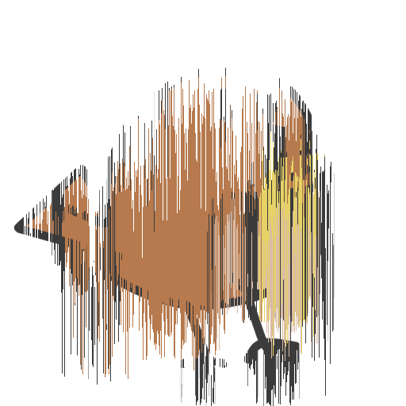

# pixsort
Pixel sort your images.

## Installation
```shell
$ sh build.sh
```

## Usage
```shell
$ ./pixsort assets/bird512.png
Loaded `assets/bird512.png` (width: 512 | height: 512)
Writing image to `assets/bird512.pngsorted.png`...
```

## Output


## Credits
`stb_image.h` and `stb_image_write.h` from https://github.com/nothings/stb
